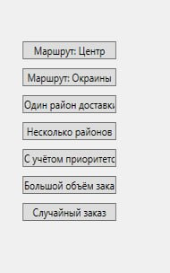
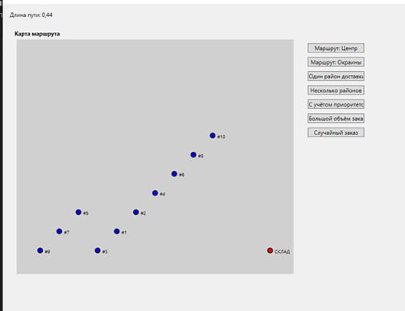
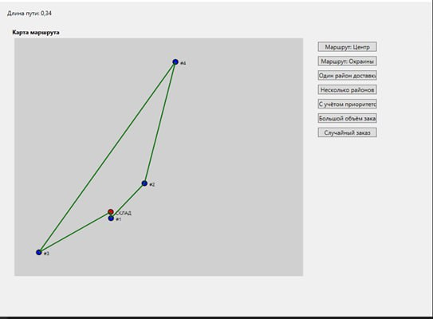
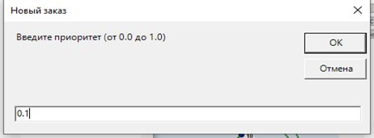

# BestDeliveryApps

 

## 📦 О проекте

**BestDeliveryApps** — это приложение на C# с использованием WPF, которое позволяет планировать маршруты доставки с учетом приоритетов заказов, визуализировать их на карте и оптимизировать путь. Приложение поддерживает различные сценарии доставки, добавление заказов вручную и анимацию построения маршрута.


## 🎯 Описание

Приложение разработано для демонстрации алгоритмов оптимизации маршрутов (например, A* с учетом приоритетов) и визуализации данных в реальном времени. Оно включает:

* 🗺️ **Интерактивную карту** с маркерами и подписями точек.
* 🔄 **Поэтапную анимацию** построения маршрута.
* 🏙️ **Поддержку нескольких сценариев** доставки (Центр города, Окраины и т.д.).
* 🖱️ **Возможность добавления заказов** с указанием приоритета через клик мышью.

## 🚀 Установка

> Шаги по установке проекта.

### Клонирование репозитория
```powershell
git clone https://github.com/ваш_пользователь/delivery-route-planner.git
cd delivery-route-planner
```

### Зависимости
- .NET SDK (версия 6.0 или выше)
- Visual Studio 2022 (или другая IDE с поддержкой WPF)

### Сборка
```powershell
dotnet build
```

### Запуск
```powershell
dotnet run
```

## 🎮 Использование

Выбор сценария:

Нажмите одну из кнопок (Центр, Окраины, Один район и т.д.) для загрузки предопределенного набора заказов.

Кнопка "Случайный" выбирает случайный сценарий.

Добавление заказов:

Щелкните ЛКМ на карте для добавления нового заказа.

Введите приоритет (от 0.0 до 1.0) в появившемся окне.

Визуализация:

Маршрут отображается на карте с анимацией линий.

Точки подписаны (например, "СКЛАД" или "#ID").

Длина маршрута отображается в текстовом поле.

## 🗂️ Структура кода

BestDeliveryApps/: Основной проект WPF.

DeliveryWindow.xaml/cs: Главное окно приложения с UI и логикой.

BestDelivery/: Логика бизнес-уровня.

DeliveryManager.cs: Управление заказами и маршрутами.

DeliveryOptimizer.cs: Оптимизация маршрута с A*.

DeliveryDistanceCalculator.cs: Расчет длины маршрута.

DeliveryRoadSimulator.cs: Симуляция данных трафика.

CustomPriorityQueue.cs: Очередь с приоритетами для A*.

OrderArrays.cs: Содержит предопределенные наборы заказов для сценариев.

## 📊 Графики

> Примеры результатов тестирования и анализа маршрутов.

### График 1. Длина маршрута в зависимости от приоритета


### График 2. Время оптимизации маршрута


### График 3. Зависимость длины маршрута от числа заказов


### График 4. Сравнение различных сценариев доставки


## 🤝 Вклад

Приветствуются pull request'ы и предложения! Пожалуйста, создавайте issue для багов или идей улучшений.

Форкните репозиторий.

Создайте ветку для своей функции (git checkout -b feature/название).

Зафиксируйте изменения (git commit -m "Описание изменений").

Отправьте изменения (git push origin feature/название).

Откройте pull request.


